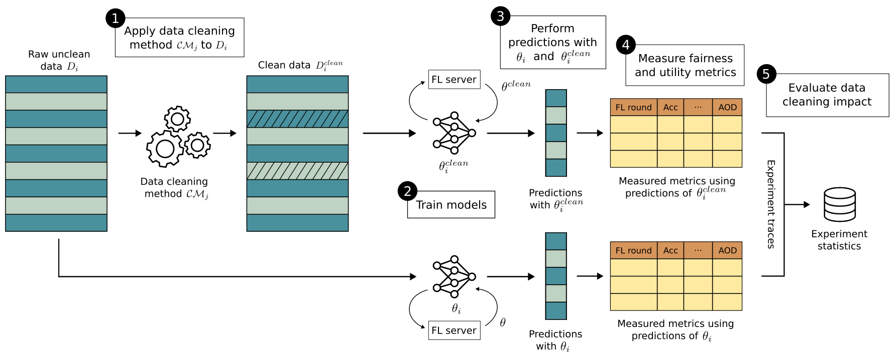

# TITANIA

**TITANIA** is an extensible framework for the evaluation of the impact of data cleaning methods on FL model utility and fairness.
It includes several datasets and models, data cleaning methods, and evaluation metrics. 
As a result, it produces various FL workload traces and their statistical analysis.

<p align="center">
  
</p>

In the following, we introduce:

- [TITANIA Features](#titania-features)  
- [Repository Structure](#repository-structure)  
- [Starting with TITANIA](#starting-with-titania)  
- [Running Experiments](#running-experiments)  
- [Producing Traces and Statistics](#producing-traces-and-statistics)
- [Reproductibility testing](#reproductibility-testing)  
- [Acknowledgments](#acknowledgments)  
- [Publications](#publications) 

---

## TITANIA Features

- Evaluation of cleaning methods on fairness and utility metrics  
- Built-in support for common ML models and real-world datasets  
- Modular design for easy extension  
- FL-round-level and aggregated result tracing  
- Integrated t-test analysis for data cleaning impact

---

## Repository Structure
```bash
├── configs/                     # Configuation files for the experiments
├── datasets/                    # TITANIA datasets
├── src/
│   ├── FL_core/                 # Core module for the FL pipeline
│   │   ├── data_loading/        # Data loading pipeline (loading, splitting, cleaning, processing, ...)
│   │   ├── fairness_eval/       # Evaluator for binary classification, including utility and fairness metrics
│   │   ├── FL_algorithms/       # Custom FL algorithms based on fluke template (client, server, ...)
│   │   └── utils/               # Configs, logger, pytorch models
│   └── TITANIA/                 # Core module for data cleaning
│       ├── data_cleaning/       # Data cleaning module (pipeline and methods)
│       ├── noise_injection/     # Noise injection module
│       └── result_statistics/   # Experiment results loading and t-tests
├── traces/                      # Output results and config file per experiment
├── TITANIA_technical_report.py  # Technical report, which provides additional information to the TITANIA article
├── main.py                      # Main Python file for launching experiments
├── README.md                    
└── requirements.txt
```
---

## Starting with TITANIA

### Software Requirements
- Python 3.13.5
- All dependencies listed in `./requirements.txt`

### Hardware Recommendations
Experiments can be run on CPU or GPU, but CPU is sufficient for the tabular datasets included in TITANIA. 

### Installation

To install the latest TITANIA version from source:

```bash
git clone https://anonymous.4open.science/r/titania-4A2C/
cd TITANIA
pip install -r requirements.txt
```

---

Then, unzip the `datasets` folder to the root of the project.

## Running Experiments

TITANIA is based on [Hydra](https://hydra.cc/) for simplifying the launch of experiments and ensuring high reproductibily with config files.
In the following, we provide examples that illustrate how to efficiently run experiments with our framework, via simple command-line (A) or through experiment config files (B).
Please look at [Hydra documentation](https://hydra.cc/docs/intro/) for further comprehension about Hydra basics.

### A- Run experiment(s) from command-line

Run `./main.py` to launch a single experiment with the default configuration values.

  ```bash
  python main.py
  ```

Config values (e.g., `exp.seed`) or config groups (e.g., `data/dataset`) can be directly overrided from the command line. Note that `+` need to be added before the config values or groups that do not have default values.

  ```bash
  python main.py exp.seed=1 data/dataset=ars +data/cleaning/outliers=default
  ```

Multiple experiments can also be run sequentially by first adding the option `-m` to the command line and then providing multiple values (separated by a comma) for the config values or the config groups.
In this case, all combinations of values to be sweeped will be crossed to launch a batch of experiments.

  ```bash
  python main.py -m exp.seed=1,2,3,4,5 data/dataset=ars,heart
  ```

### B- Run experiment(s) from a YAML experiment config file

1. Create a YAML configuration file in `./configs/experiment/` by overriding `./configs/experiment/template.yaml`. Config files saved during past experiments (`EXP_PATH/config.yaml`) can notably be copied and pasted to `./configs/experiment/` to reproduce the experiments. In that case, add ``` # @package _global_ ``` at the beggining of the files just as following:

  ```yaml
  # @package _global_

  data:

    seed: 59

    cleaning:
      name: default
      missing_values:
        name: default

    dataset:
      dataset_name: Adult
      path: ./datasets/Adult/raw_data
      sensitive_attributes: ['age', 'gender', 'race']

    distribution:
      name: iid

    loading:
      save_data_after_cleaning: false
      save_data_before_cleaning: false
      save_dir: ./datasets/Adult/static_data_loading
      static: false

    others:
      client_split: 0.2
      client_val_split: 0.5
      keep_test: false
      sampling_perc: 1.0
      server_split: 0.0
      server_test: false
      server_test_union: true
      server_val_split: 0.0
      uniform_test: false

  eval:
    eval_every: 1
    locals: false
    post_fit: false
    pre_fit: false
    server: true
    task: classification

  exp:
    device: cpu
    inmemory: true
    seed: 101
    train: true

  logger:
    json_log_dir: ${paths.output_dir}
    name: src.FL_core.utils.log.CustomLog

  method:

    name: src.FL_core.FL_algorithms.CustomCentralizedFL

    hyperparameters:

      server:
        loss: BCELoss
        time_to_accuracy_target: null
        weighted: true

      client:
        batch_size: 128
        local_epochs: 10
        loss: BCELoss
        optimizer:
          lr: 0.0001
          name: AdamW
          weight_decay: 0
        scheduler:
          gamma: 1
          name: StepLR
          step_size: 1

      model: src.FL_core.utils.net.LogRegression
      net_args:
        input_size: 99
        num_classes: 1

  paths:
    data_dir: ./datasets
    log_dir: ./logs
    output_dir: ${hydra:runtime.output_dir}
    root_dir: .

  protocol:
    eligible_perc: 1.0
    n_clients: 10
    n_rounds: 150

  save: {}
  ``` 

**IMPORTANT NOTE**: Just as command line mode, config values that are specified in the experiment config file override the default configurations. Thus, config values that are not provided in this file will be set to their default values.

For greater efficiency, another way of creating experiment config files is to directly provide specific config groups, such as in the following example:

  ```yaml
  defaults:
    - override /data/distribution: dirichlet.yaml
    - override /data/others: union_clients_test.yaml
    - override /save: null
    - override /eval: all.yaml
  ```

More examples related to config groups can be found in the experiment folder `./configs/experiment/`.

2. Run `./main.py` by specifying the path to the experiment config file (from the `./configs/experiment/` folder) in the argument `+experiment=`.

  ```bash
  python main.py +experiment=template
  ```


Just as running experiments from command-line, multiple experiments can be run sequentially by first adding the option ``` -m ``` to the command line and then specifying multiple values (separated by a comma) for the argument `+experiment=`.

  ```bash
  python main.py -m +experiment=template,template1,template2
  ```

Sweeping capabilities can also be directly added to the experiment config file. To do that, users need to (a) add the following lines at the end of the experiment config file and (b) provide the desired config values for the sweeping. Do not forget to add the ```-m ``` option in the command line.

  ```yaml
  hydra:
    sweeper:
      params:
        exp.seed: 1,2,3,4,5
  ```

Finally, running experiment config file can be also combined with the command line way of specifying config values.

  ```bash
  python main.py -m +experiment=template exp.seed=1,2,3,4,5
  ```

---

## Producing Traces and Statistics

TITANIA supports detailed trace logging to evaluate the impact of data cleaning on model fairness and utility.

### Output Trace Files

There are 4 main experiment folders that corresponds to the experimental evaluation subsections of TITANIA paper (+1 extra folder referred to `overall_impact_non_iid` for additional experiments):

- `./traces/overall_impact` measures each data cleaning method for relevant datasets and models over 5 runs in a IID setting;

- `./traces/bias_mitigation` focuses on the impact of bias mitigation with ASTRAL using and not using cleaning;

- `./traces/FL_non_iid_settings` studies the impact of varied alpha parameter for the dirichlet ditribution;

- `./traces/bias_mitigation` injects label errors and measures data cleaning impacts;

- `./traces/overall_impact_non_iid` measures each data cleaning method for relevant datasets and models over 5 runs in a non-IID setting.

Each of these folders contains traces organized into folders and subfolders that correspond to the configurations of the experimental scenarios.
For instance, `./traces/overall_impact/dataset=Adult/model=LogRegression/data_cleaning=default/exp_seed=101,data_seed=59/` is the experimental scenario folder corresponding to the **overall impact** section of the TITANIA paper with the Adult dataset, the logistic regression model, the baseline no cleaning method, and the experiment seed that equals 101.

Each experimental scenario folder contains:
- `results.json`, a JSON file that contains all metrics of the experiments (e.g., global metrics computed on the server side, local metrics computed on the clients side, communication costs, training time).
Depending on the experimental scenario, there are six types of metrics categories:
  - `perf_global`: metrics for each round, from the evaluation of the global model on the server side (with the server test set) after aggregation;
  - `comm_costs`: communication costs for each round;
  - `perf_locals`: metrics for each round and client, from the evaluation of the clients models on the server side (with the server test set) after training;
  - `perf_prefit`: metrics for each round and client, from the evaluation of the clients models on the client side (with the clients test sets) before the client local training processes start;
  - `perf_postfit`: metrics for each round and client, from the evaluation of the clients models on the client side (with the clients test sets) once the client local training processes have been completed;
  - `custom_fields`: other global metrics, such as training times.

- `config.yaml`, a YAML file that describes the configurations of the experiment. This file can be used to re-run the experiment with TITANIA (see [Running experiment - B.](#running-experiments)) and compute the `results.json` file of the scenario.

---

## Reproductibility testing


In this section, you can test the reproductibility of our experiments.
We first provide a basic run to test the functionning of the TITANIA framework, then propose to reproduce part of a graph of the paper, and we finally explain how you could reproduce all results. 
Note that all experiments are run on machines equipped with two Intel Xeon Gold 6130 CPUs (16 cores each) and 192 GB of RAM. Please do not use GPU for reproductibility testing.

### 1. Basic run (2 minutes human time, 7 minutes CPU time)

To test the general functioning of the code, we start with a basic example: the OL-std-mean-G cleaning method applied on the Adult Dataset, an IID setting, with a logistic regression model.

Run this short command for training the model:

```bash
  python main.py +experiment=overall_impact/Adult/LogRegression/basic_example
```

After the script is completed, the output files are saved in the subfolder of `outputs/Adult/EXP_TIMESTAMP` (with `EXP_TIMESTAMP` the timestamp of the experiment).
It should contain a file `results.json` with the same values as the result experiment in `traces/overall_impact/dataset=Adult/model=LogRegression/data_cleaning=OL-std-mean-G/exp_seed=101,data_seed=59/results.json`.
You can find an explanation of the metrics in [this section](#producing-traces-and-statistics).

You can use the script `traces/compare_results_json.py` to compare the global performance of the two JSON files:

```bash
  python traces/compare_results_json.py --path_to_json_1 PATH_TO_YOUR_JSON --path_to_json_2 traces/overall_impact/dataset=Adult/model=LogRegression/data_cleaning=OL-std-mean-G/exp_seed=101,data_seed=59/results.json
```

### 2. Partial results of Figure 4 (5 minutes human time, 1h30 CPU time)

Then, we propose you to partially reproduce the Figure 4 of the paper.
It focuses on 8 experiments, which considers 2 combinations of cleaning methods (*w/o cleaning* being the baseline without cleaning, and *w/ cleaning+* being with cleaning by two Federated learning solutions, i.e., FedCorr for label errors and Cafe for missing values, as well as a mathematical outlier cleaning method, i.e., OL-std-mode-L) and 4 data distributions (*IID*, *non-IID 0.01*, *non-IID 0.05*, and *non-IID 0.1*).

We have prepared two experiment config files to partially reproduce the varied dirichlet figure in our paper.

```bash
python main.py -m +experiment=FL_non_iid_settings/Adult/dirichlet_example
```

```bash
python main.py -m +experiment=FL_non_iid_settings/Adult/iid_example
```

This create subfolders with the outputs in `outputs/FL_non_iid_settings/Adult/EXP_TIMESTAMP` (with `EXP_TIMESTAMP` the timestamp of the experiment).

Create a folder example and within it dataset=Adult. Then drag and drop the relevant folders so that the structure is:

```bash
├── traces
│   ├── example/
│   │   ├── dataset=Adult/
│   │   │   ├── data_distribution_name=iid/
│   │   │   ├── data_distribution_name=label_dirichlet_skew,dirichlet_alpha=0.1/
│   │   │   ├── data_distribution_name=label_dirichlet_skew,dirichlet_alpha=0.01/
│   │   │   ├── data_distribution_name=label_dirichlet_skew,dirichlet_alpha=0.05/
```

Then run these two lines to create graphs, the first one creates a CSV in the `traces/example/dataset=Adult` folder, the second one creates graphs in the `plot/example/Adult` folder:

```bash
python ./traces/create_dataset.py --dataset Adult --experiment=example
```

```bash
python ./traces/graphs.py --dataset Adult --experiment=example
```

The `plot/example/Adult/non_iid_Accuracy_EOD_race.pdf` plot should be the same as the plot in the paper (with only squares and circles) with some differences in dimensions.

### 3. All results of the paper

Finally, we explain how to create all traces and how to use them to reproduce all tables and figures of the paper.
Note that you can also reproduce the tables and figures directly from the traces folder that we provide.

#### A- Run all experiments (60 minutes human time, 60 days CPU time)

Running the full experiments is a matter of following the file structure and running the relevant configuration YAML files (in the `configs/experiment` folder). One must first select a **section** (*overall_impact*, *FL_non_iid_settings*, *error_rates*, *bias_mitigation*). In each case there are five **datasets** (*Adult*, *ARS*, *Heart*, *KDD*, *MEPS*) and for *overall_impact* we add dirichlet cases (*Adult_001*, *ARS_001*, *Heart_001*, *KDD_001*, *MEPS_001*). For *overall_impact* there are 3 **models** per dataset (*SVM*, *MLP*, *LogRegression*).

Finally, one must select the **file**. For *bias_mitigation*, there *astral* and *no_astral*. For *error_rates*, the file is just the dataset's name. For *FL_non_iid_settings*, it's *dirichlet_01*, *dirichlet_001*, *dirichlet_005*, *iid*. For *overall_impact*, it's *outliers*, *label_errors*, *default*, and finally *missing_values* (the last only for KDD and Adult).

```bash
python main.py -m +experiment=SECTION_NAME/DATASET_NAME_OPTIONAL/MODELS_NAME_OPTIONAL/FILE_NAME
```


#### B- Produce all result tables of the paper (2 minutes human time, 2 minutes CPU time)

Finally, run the following command to compute all result tables (i.e., Tables 3 to 7) based on your traces:

```bash
python ./src/TITANIA/result_statistics/print_tables.py --exp_name YOUR_EXP_NAME
```

with `YOUR_EXP_NAME`, the name of your experiment folder in the `traces` folder.

As you don't have the time to run all experiments, you can produce the tables from the experiment folder `traces/overall_impact`.

#### C. Produce all result graphes of the paper (2 minutes human time, 25 minutes CPU time)

To create all the graphs from the paper using the traces previously produced, run these commands (if you only want the graphs in the paper replacing `Heart,ARS,KDD,MEPS,Adult` by `Adult` makes running the code faster).

The first one creates CSVs based one the traces:

```python ./src/TITANIA/result_statistics/create_dataset.py --dataset Heart,ARS,KDD,MEPS,Adult --experiment=FL_non_iid_settings,error_rates,bias_mitigation```

The second creates a plot structure:

```python ./src/TITANIA/result_statistics/graphs.py --dataset Heart,ARS,KDD,MEPS,Adult --experiment=FL_non_iid_settings,error_rates,bias_mitigation```

The plots folder includes all the combinations we could use. The relevant ones in the paper are:

- plot/FL_non_iid_settings/Adult/non_iid_Accuracy_EOD_race.pdf
- plot/bias_mitigation/Adult/bias_mitigation_accuracy.pdf
- plot/bias_mitigation/Adult/bias_mitigation_SPD_race.pdf
- plot/error_rate/Adult/error_rate_precision.pdf
- plot/error_rate/Adult/error_rate_AOD_race.pdf

## Contributing

TITANIA is designed to be modular an flexible so adding features is meant to practical and simple.

### How to Extend TITANIA

- **Add new datasets**:
  1. Download and add the dataset in the folder `./datasets/DATASET_NAME/`.
  2. Update the dataset loader in `./src/FL_core/data_loading/sensitive_datasets.py` to integrate a new dataset along with its raw preprocessing.
  3. Create a YAML config file with the name of the dataset in the folder `./configs/data/dataset/` to provide the new option for the config group `data/dataset`.

- **Add new ML model**:

  1. Update `./src/FL_core/utils/net.py` by implementing the new ML model.
  2. The model can then be used in the experiments by replacing the config value `method.hyperparameters.model` (or for some model the loss function in the config value `method.hyperparameters.client.loss`).

- **Implement new cleaning method**:

  1. [Optional] If the method addresses a new type of error:
      1) Modify the function `clean_data()` in the data cleaning pipeline (i.e., `./src/TITANIA/data_cleaning/pipeline.py`).
      2) Create the folder `./src/TITANIA/data_cleaning/ERROR_TYPE/`, with `ERROR_TYPE` the error type tackled by the cleaning method, and implement `./src/TITANIA/data_cleaning/ERROR_TYPE/_init_.py`.
  2. Add a new data selection method to the folder `./src/TITANIA/data_cleaning/ERROR_TYPE/`.
  3. Include the new data cleaning class in `./src/TITANIA/data_cleaning/ERROR_TYPE/_init_.py` so that it can be called during the experiments.
  4. Create a YAML config file with the name of the data cleaning method in `./configs/data/cleaning/ERROR_TYPE/` to provide the new option for the config group `data/cleaning/ERROR_TYPE`.

- **Add new noise injection option**: 

  The file `./src/TITANIA/noise_injection/add_noise.py` can be parametered to add new noise injection options.

---

## Acknowledgments

TITANIA is based on [Fluke](https://makgyver.github.io/fluke/) to start from an existing FL framework and add fairness-specific components to it.
TITANIA adds several data cleaning options by importing or re-implementing three previous data cleaning methods: the ML solution [Cleanlab](https://cleanlab.ai/) and the FL solutions [Cafe](https://github.com/sitaomin1994/federated_imputation) and [FedCorr](https://github.com/Xu-Jingyi/FedCorr).

---

## Publications

TBD.
